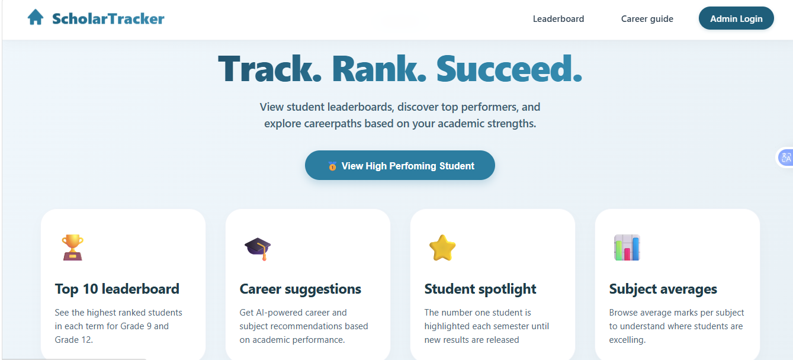
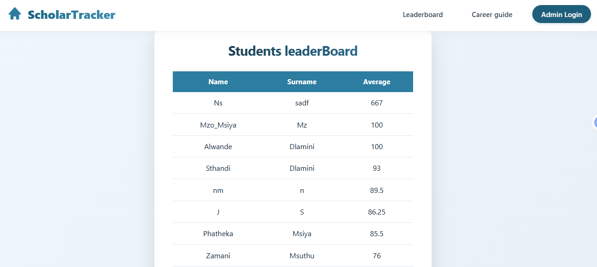
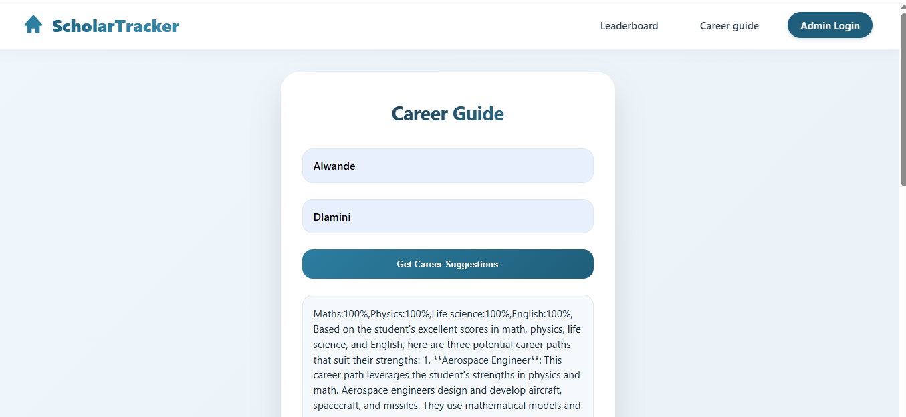
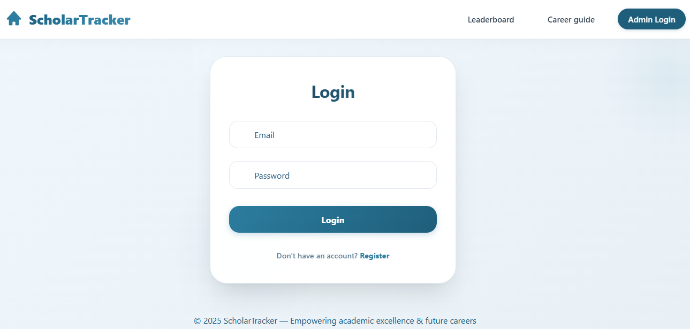

# 🎓 ScholarTracker

**Track. Rank. Succeed.**

ScholarTracker is a full-stack web application that helps schools track student performance, recognise top achievers, and provide AI-powered career recommendations based on academic results.

---

## 🌐 Live Demo

[ScholarTracker](https://track-app-six-mu.vercel.app/)

---

## 📸 Screenshots

### Home Page



### Leaderboard



### Career Guide



### Admin Login




## 🎯 Purpose

ScholarTracker was developed as a portfolio project to explore full-stack web development concepts, including authentication, database management, REST APIs, and AI integration.

The goal is to provide schools with a platform that helps recognise academic achievement while assisting students in exploring career paths aligned with their strengths.

---

## 🌟 What is ScholarTracker?

ScholarTracker is a school performance platform built for students and administrators.

Students can:

* View their academic ranking
* See the top-performing students
* Receive personalised AI-powered career recommendations based on their marks

Administrators can:

* Register students
* Capture subject marks
* Manage student academic information
* Keep the leaderboard updated

---

## ✨ Features

| Feature                    | Description                                                                            |
| -------------------------- | -------------------------------------------------------------------------------------- |
| 🏆 **Leaderboard**         | Displays the top 10 students ranked by average mark in real time.                      |
| 🥇 **Student Spotlight**   | Highlights the highest-performing student.                                             |
| 🎯 **Career Guide**        | Provides 3 AI-powered career suggestions based on student marks.                       |
| 📊 **Subject Averages**    | Allows users to browse performance across all subjects.                                |
| 🔐 **Admin Login**         | Secure administrator authentication using Firebase Authentication.                     |
| ➕ **Student Registration** | Enables administrators to add students, subjects, and marks through an intuitive form. |

---

## 🔮 Planned Features

* Support for Grade 11 students
* Separate leaderboards by grade level
* Semester filtering on the leaderboard
* Mobile-responsive design improvements
* Student self-login to view personal marks
* Export student reports to PDF
* Enhanced analytics and performance insights

---

## 🚀 Getting Started

### Prerequisites

Before running the project locally, make sure you have:

* Node.js installed
* A Firebase project configured
* A Groq API key

### Installation

Clone the repository:

```bash
git clone https://github.com/yourusername/ScholarTracker.git
cd ScholarTracker
```

Install dependencies:

```bash
npm install
```

Start the backend server:

```bash
node firebaseAdd.js
```

Open `primary_html.html` in your browser or use a local development server such as Live Server in VS Code.

---

## 🧭 How to Use It

### As a Student

* Open the application from the home page.
* Navigate to **Leaderboard** to view the top 10 students.
* Select **Career Guide**.
* Enter your name and surname.
* Click **Get Career Suggestions**.
* The application will analyse your marks and provide 3 AI-powered career recommendations.
* Select **View High Performing Student** to see the highest-ranked student.

### As an Admin

* Select **Admin Login** in the navigation bar.
* Log in using administrator credentials provided by the system administrator.
* You will be redirected to the Student Registration page.
* Enter the student's details, subjects, and marks.
* Click **Add Student** to save the student information.

---

## 🔐 Admin Access

Administrator accounts are managed by the project owner through Firebase Authentication.

To access administrator features, valid credentials must be provided by the system administrator. Public self-registration for administrator accounts is not available.

---

## 🗂️ Project Structure

```text
ScholarTracker/
├── primary_html.html       # Main HTML file
├── primary_css.css         # Styling
├── HandleFunction.js       # Navigation logic
├── Authentic.js            # Firebase configuration
├── LoginLogic.js           # Admin authentication
├── studentsMarks.js        # Student registration logic
├── leaderBoardApi.js       # Leaderboard functionality
├── CareerApi.js            # AI career suggestions
├── firebaseAdd.js          # Express backend API
├── schoolTracker.json      # Firebase service account key (private)
└── .gitignore
```

---

## 🛠️ Built With

* **HTML / CSS / JavaScript** — Frontend development
* **Firebase Authentication** — Administrator login system
* **Firebase Firestore** — Database storage
* **Node.js + Express** — Backend API server
* **Groq API (LLaMA 3)** — AI-powered career recommendations
* **Boxicons** — Icons and UI assets

---

## 📚 Current Scope

ScholarTracker currently supports **Grade 12 students only**.

Features such as ranking, career recommendations, and student registration are tailored specifically for Grade 12 academic data.

Support for additional grades, including Grade 11, is planned for future releases.

---

## ⚠️ Security Notes

* `schoolTracker.json` contains Firebase service account credentials and should never be committed to GitHub.
* API keys should be stored securely using environment variables in production environments.

---

## 👨‍💻 Author

**Mzothando Msiya**

Built as a portfolio project to demonstrate full-stack web development with Firebase and AI integration.

GitHub: https://github.com/MsiyaYNWA2005

---

## 📄 License

This project is open source and available for educational use.
